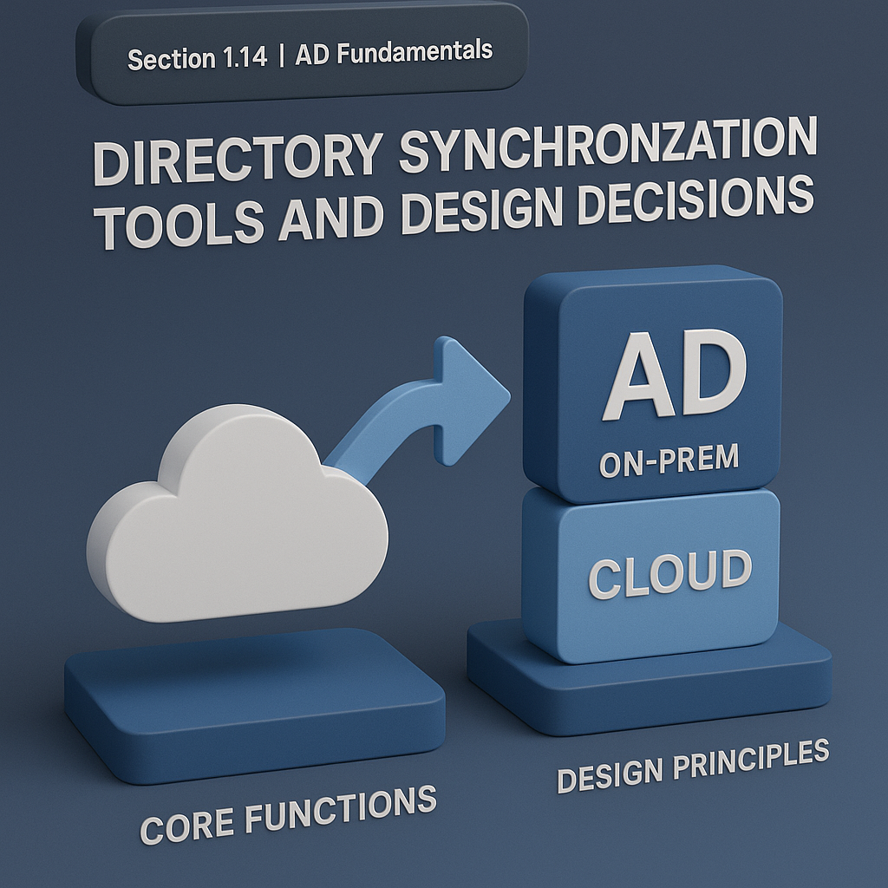

# 🏆 `Section 1.14` | AD Fundamentals - **“Directory Synchronization Tools and Design Decisions”**

Sync agents do straightforward work. The trick is design. Small choices up front decide whether your migration is smooth or painful.  
Treat the sync service as **critical infrastructure**: plan scope, mapping, availability, and monitoring.

---

## 🔧 Core Functions a Sync Tool Performs
- Copy selected AD attributes to the cloud  
- Match identities using a key like **UPN** or **ImmutableID**  
- Optionally write selected attributes back to AD  
- Run lightweight agents that must be reachable and monitored  

---

## 🎯 Design Principles to Follow
- Start with a **small scope** and expand in waves  
- Align **UPN with the user sign-in name** before you sync  
- Inventory attributes apps need and mark required fields  
- Decide **matching rules** early and test on sample accounts  
- Harden the sync account with **least privilege** and **credential rotation**  
- Plan **high availability** for agents and the sync server  
- Centralize logs and **alert on failures and anomalies**  

---

## 📋 Compact Rollout Checklist
- ✅ UPN alignment confirmed for test users  
- ✅ Attribute inventory and mapping completed  
- ✅ Identity matching rule tested on sample accounts  
- ✅ OU scope and wave plan documented  
- ✅ Password writeback decision recorded  
- ✅ Sync account privileges minimized and rotated  
- ✅ Agent HA and firewall rules validated  
- ✅ Logging, monitoring, and alerts in place  
- ✅ Smoke tests and rollback steps documented  
- ✅ Time sync, DNS, and AD replication health verified  

---

## ✅ Takeaway
The tool is simple. **Good design is not.**  
Choose small waves, test matching thoroughly, harden the sync account, and monitor everything from day one.

---

👉 Back: [1.13 Hybrid Identity Patterns: Sync, Federation, Pass-Through Auth, Password Hash Sync](./1.13-hybrid-identity.md)  
👉 Next: [1.15 Practical Pitfalls and Migration Considerations](./1.15-pitfalls-migration.md)
